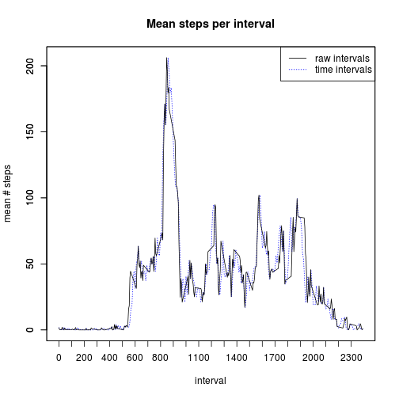
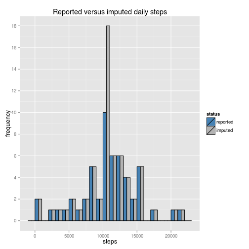
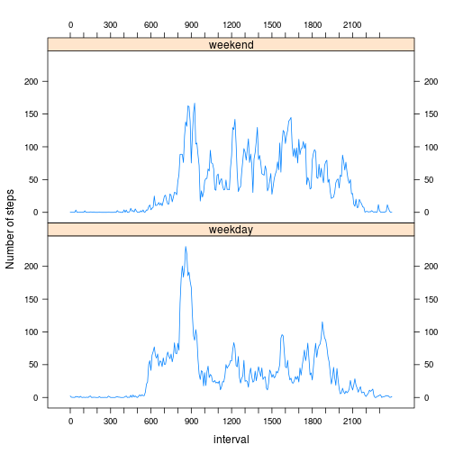

## Loading and preprocessing the data

**Show any code that is needed to**

**Load the data (i.e. read.csv())**

Reading the file required unzipping it.


```r
tbl <- read.csv(unzip("activity.zip", "activity.csv"), header=TRUE, stringsAsFactors=FALSE)
# Remove the unzipped file after reading
unlink("activity.csv")
```

**Process/transform the data (if necessary) into a format suitable for your analysis**

The date column was converted to Date objects. The 5-minute intervals also need to be mapped to Time objects - but that will happen later, after we've averaged over intervals.


```r
# Make date strings into Date objects
tbl$date <- as.Date(tbl$date, "%Y-%m-%d")
```

## What is mean total number of steps taken per day?

**For this part of the assignment, you can ignore the missing values in the dataset.**

To extract the rows without missing values, the `complete.cases()` function comes in handy.


```r
t_complete <- tbl[complete.cases(tbl),]
```

**Make a histogram of the total number of steps taken each day**


```r
reported_steps_per_day <- aggregate(steps ~ date, t_complete, sum)
hist(reported_steps_per_day$steps, main="Total reported daily steps",
     col="steelblue", xlab="")
```

 

**Calculate and report the mean and median total number of steps taken per day**


```r
mean(reported_steps_per_day$steps)
```

```
## [1] 10766.19
```

```r
median(reported_steps_per_day$steps)
```

```
## [1] 10765
```

## What is the average daily activity pattern?

**1. Make a time series plot (i.e. type = "l") of the 5-minute interval (x-axis) and the average number of steps taken, averaged across all days (y-axis)**

After averaging over the intervals, I mapped the intervals to timestamps with an arbitrary date and plotted against those. This makes the curve smoother, because e.g. the gap between 155 (1:55 AM) and 200 (2:00 AM) is 5, not 45.


```r
# Average steps over intervals
mean_steps_per_interval <- aggregate(steps ~ interval, mean, data=t_complete)

# Function maps intervals to timestamps
interval2time <- function(interval,date=tbl$date[1]) {
  hours <- interval %/% 100
  minutes <- interval %% 100
  hm_string <- sprintf("%02i:%02i", hours, minutes)
  as.POSIXct(paste(date,hm_string))
}

# Add a timestamp column using function defined above
mean_steps_per_interval$timestamp <-
  sapply(mean_steps_per_interval$interval, interval2time)
```


```r
# Plot against time intervals
plot(main="Mean steps per interval",
     x=mean_steps_per_interval$timestamp,
     y=mean_steps_per_interval$steps, type="l",
     col="blue", lty="dotted",
     xlab="",ylab="",xaxt="n")
# but use raw interval labels, to make life easy for graders
axis(1, at=seq(interval2time(0),by="1 hour",length=24),
                  labels=seq(0,2300,by=100))

# Plot against raw intervals
par(new=T)
plot(x=mean_steps_per_interval$interval,
     y=mean_steps_per_interval$steps, type="l",
     ylab="mean # steps", xlab="interval",xaxt="n")

legend("topright",
       c("raw intervals","time intervals"),
       col=c("black","blue"),
       lty=c("solid","dotted"))
```

 

Note how the curves plotted against raw vs. time intervals differ at crucial inflection points, e.g. between 5 and 6 AM (600), at noon (1200), and between 7 and 8 PM (2000).
 
Looks as if there's a furious burst of activity between 8 and 9 AM, as people get up and scramble to prepare for the day. Then people are about half as active, more or less, until around 8 PM, when the activity levels taper off.

**2. Which 5-minute interval, on average across all the days in the dataset, contains the maximum number of steps?**


```r
subset(mean_steps_per_interval, steps == max(steps), select=c(interval,steps))
```

```
##     interval    steps
## 104      835 206.1698
```

The interval is 835, containing an average of 206 steps per day. So, as the graph implies, peak activity is at 8:35 AM.  Not a good time to ride the Metro!

## Imputing missing values

**Note that there are a number of days/intervals where there are missing values (coded as NA). The presence of missing days may introduce bias into some calculations or summaries of the data.**

**Calculate and report the total number of missing values in the dataset (i.e. the total number of rows with NAs)**

Use complete.cases again, this time negated to find the rows with missing values.


```r
t_missing <- tbl[!complete.cases(tbl),]
nrow(t_missing)
```

```
## [1] 2304
```
There are 2304 rows. Just for kicks, let's see how many NA values there are for each day.


```r
na.count <- function(d) { sum(is.na(tbl[tbl$date == d,][["steps"]])) }
unique_dates <- unique(tbl$date)
t_date2na <- data.frame(date = unique_dates, na_count = sapply(unique_dates, na.count))
length(unique_dates)
```

```
## [1] 61
```

```r
na_days <- subset(t_date2na, na_count > 0)
na_days
```

```
##          date na_count
## 1  2012-10-01      288
## 8  2012-10-08      288
## 32 2012-11-01      288
## 35 2012-11-04      288
## 40 2012-11-09      288
## 41 2012-11-10      288
## 45 2012-11-14      288
## 61 2012-11-30      288
```

```r
nrow(na_days)
```

```
## [1] 8
```

So 2304 rows = 8 days x 24 hours x 12 five-minute intervals per hour. Of the 61 days total, there are eight days with all values missing, and no values missing elsewhere. Good to know!

**Devise a strategy for filling in all of the missing values in the dataset. The strategy does not need to be sophisticated. For example, you could use the mean/median for that day, or the mean for that 5-minute interval, etc.**

OK, I'll use the mean for that 5-minute interval, since it's been calculated already.

**Create a new dataset that is equal to the original dataset but with the missing data filled in.**


```r
# Fill in missing values from mean_steps_per_interval
t_missing$steps <- sapply(t_missing$interval, function(i) {
  as.numeric(subset(mean_steps_per_interval, interval == i, steps))
})

# Combine complete cases and now-no-longer-incomplete cases
t_imputed <- rbind(t_complete,t_missing)
```

**Make a histogram of the total number of steps taken each day and** [...]


```r
imputed_steps_per_day <- aggregate(steps ~ date, sum, data=t_imputed)

hist(imputed_steps_per_day$steps, main="Reported + imputed daily steps",
     col="gray70", xlab="")
```

 

The graph below compares the reported and imputed totals: exactly the same, except for the eight days with missing values. Originally, there were 10 days containing the mean number of steps. Now there are 18.


```r
# Set up a data frame comparing reported to imputed totals.
library(reshape2)
# Throw both totals into a list with appropriate labels...
totals <- list(reported=reported_steps_per_day,imputed=imputed_steps_per_day)
# ...and melt it down, so that the labels become their own column.
comparison <- melt(totals, id.vars=c("date","steps"))
names(comparison) <- c("date", "steps", "status")
comparison$status <- factor(comparison$status, levels=c("reported", "imputed"))
```

```r
library(ggplot2)
ggplot(comparison,aes(x=steps,fill=status)) +
  # position "dodge" = side by side
  geom_histogram(binwidth=1000,position="dodge",colour="black") +
  # less ugly than the default colors
  scale_fill_manual(values=c("steelblue","gray70")) +
  scale_y_continuous(name="frequency",breaks=seq(0,20,by=2))
```

 

**Calculate and report the mean and median total number of steps taken per day.**


```r
mean(imputed_steps_per_day$steps)
```

```
## [1] 10766.19
```

```r
median(imputed_steps_per_day$steps)
```

```
## [1] 10766.19
```

**Do these values differ from the estimates from the first part of the assignment?**

Yes. The mean is the same, but the median has increased slightly.


```r
mean(imputed_steps_per_day$steps) - mean(reported_steps_per_day$steps)
```

```
## [1] 0
```

```r
median(imputed_steps_per_day$steps) - median(reported_steps_per_day$steps)
```

```
## [1] 1.188679
```

**What is the impact of imputing missing data on the estimates of the total daily number of steps?**

The median is now equal to the mean, because of the extra imputed days with exactly the mean number of steps. This reduces the variation in the data set; see the density curves below.


```r
ggplot(comparison, aes(x=steps,colour=status)) + geom_density() +
  scale_color_manual(values=c("steelblue","gray70"))
```

 

This reduced variability may affect estimates like the one in the next section.

## Are there differences in activity patterns between weekdays and weekends?

**For this part the weekdays() function may be of some help here. Use the dataset with the filled-in missing values for this part.**

**Create a new factor variable in the dataset with two levels -- "weekday" and "weekend" indicating whether a given date is a weekday or weekend day.**


```r
# Define a function mapping date to weekend/weekday
day_type <- function(date) {
  if (weekdays(date) %in% c("Saturday","Sunday")) "weekend" else "weekday"
}

# Add a column using this function
t_imputed$day_type <- as.factor(sapply(t_imputed$date, day_type))
```

Note that using the imputed values could obscure the patterns we're looking for, since the averages were computed over all days. The eight days with missing values were a mix of weekdays and weekends:


```r
summary(as.factor(sapply(subset(t_date2na, na_count > 0)[["date"]], day_type)))
```

```
## weekday weekend 
##       6       2
```

**Make a panel plot containing a time series plot (i.e. type = "l") of the 5-minute interval (x-axis) and the average number of steps taken, averaged across all weekday days or weekend days (y-axis).**


```r
mean_steps2 <- aggregate(steps ~ interval + day_type, mean, data=t_imputed)

# Again, we add a timestamp column mapping intervals to timestamps
mean_steps2$timestamp <- sapply(mean_steps2$interval, interval2time)

library(lattice)

# Plot against timestamps...
xticks <- seq(interval2time(0), by="1 hour",length=24)
# but label the x-axis by intervals so as not to confuse the grader
xlabels <- seq(0,2400,by=300)
xlabels <- as.vector(rbind(xlabels,"",""))

# Do the plot
xyplot( steps ~ timestamp | day_type, data=mean_steps2, type="l",
        xlab="interval", ylab="Number of steps", layout=c(1,2),
        scales=list(alternating=3, x=list(at=xticks, labels=xlabels)) )
```

 

Not surprising. That burst of early-morning activity we noticed in the earlier time series is confined to weekdays, when people have to get to work and school. On weekends, people get up and go to bed a couple of hours later, and have greater overall activity levels all day.
